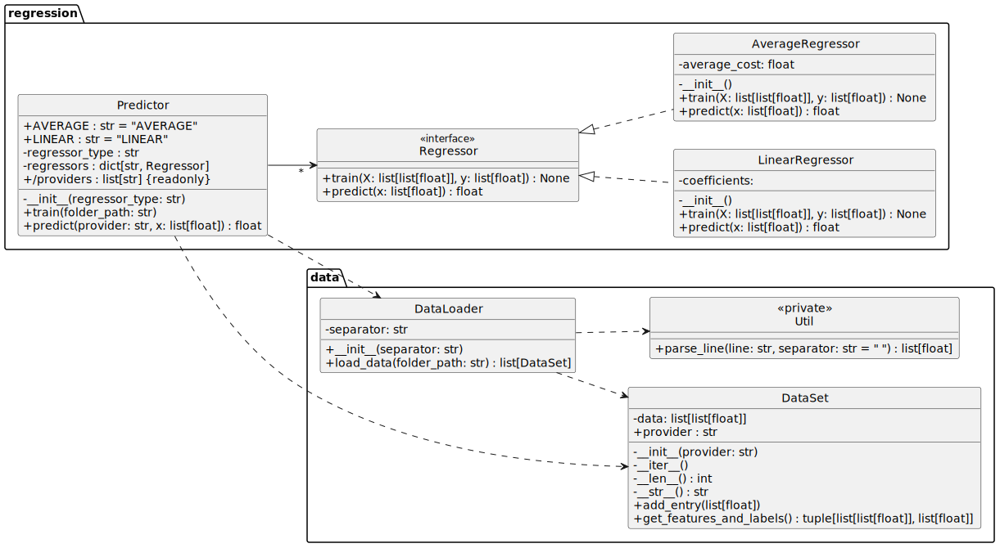

[](https://classroom.github.com/a/ebruyScT)
# Práctica 1 - Programación Orientada a Objetos

# Implementación de un sistema de predicción de costes de servicios en la nube

## Introducción  
En esta práctica practicarás la Programación Orientada a Objetos (POO) implementando un sistema de **predicción del coste de entrenamiento en la nube**. Trabajarás con datos de consumo de recursos de distintos proveedores en la nube (AWS, Google Cloud, Azure), organizados en archivos, y desarrollarás modelos de regresión para estimar los costes en función del uso de recursos.  

Deberás estructurar el código en distintas clases para la carga de datos, procesamiento de la información y regresión. Para asegurar el buen funcionamiento del código, contarás con **pruebas automatizadas con `unittest`** para validar el funcionamiento del código y asegurar su correcto desarrollo.  

## Evaluación

La evaluación de la práctica se realizará mediante la **ejecución de pruebas automáticas** que validarán el correcto funcionamiento de las clases y métodos implementados. El código deberá cumplir con los requisitos y restricciones detallados en el enunciado y, en caso de duda, **deberás respetar el comportamiento esperado de acuerdo a las pruebas proporcionadas**.

**Es importante que respetes los nombres de las clases y métodos** indicados en el enunciado para que las pruebas puedan ejecutarse correctamente. **No debes modificar los nombres de las clases y métodos públicos** que se solicitan en el enunciado.

**NO ESTÁ PERMITIDO modificar las pruebas automatizadas**. Si lo haces obtendrás un 0 en la práctica.

## Instrucciones

El proyecto cargará históricos de consumo para distintos proveedores, los procesará y entrenará modelos de regresión para predecir el coste de uso de los servicios en la nube.

Los datos están organizados en carpetas con archivos para cada proveedor, donde cada archivo contiene múltiples líneas con registros de uso de recursos. Cada línea contiene cinco valores separados por comas: `low, medium, high, tiempo, coste`, donde:
- `low`, `medium` y `high` son los valores de consumo de recursos en tres categorías distintas (servidores de potencia baja, media y alta).
- `tiempo` es el tiempo de uso de los recursos.
- `coste` es el coste total pagado por el uso de los recursos durante el tiempo indicado.

Cada línea de un archivo representa un registro de uso de recursos y su coste asociado. Cada archivo contiene múltiples registros de uso de recursos y cada carpeta contiene múltiples archivos para un proveedor específico (sólo un proveedor por carpeta).

En la carpeta `data` puedes encontrar un ejemplo de la estructura de los archivos de consumo de recursos de los proveedores.

El objetivo es entrenar un modelo de regresión que permita predecir el coste de uso de los servicios en la nube en función del consumo de recursos.

El proyecto usa la librería `numpy` para el manejo de matrices y operaciones matemáticas. Puedes instalarla con el comando:

```bash
pip install -r requirements.txt
```

## Estructura del proyecto

A continuación se detalla la estructura de las clases y métodos que deberás implementar en este proyecto.

Consideraciones:
- **Puedes añadir tantos métodos y atributos como consideres necesarios** para implementar la funcionalidad requerida, pero **todos deberán ser privados**.
- Asegúrate de que todas las clases y métodos tengan comentarios descriptivos para entender su funcionamiento.



### Paquetes y módulos

El proyecto se organiza en los siguientes paquetes y módulos:
- **`data`**: Contiene las clases relacionadas con la carga y procesamiento de datos.
    - **`DataLoader`**: Clase para cargar los datos de los archivos de log.
    - **`DataSet`**: Clase `DataSet` para almacenar y gestionar los datos de consumo de recursos.
    - **`Util`**: Clase con métodos auxiliares para el procesamiento de datos.
- **`regression`**: Contiene las clases relacionadas con la regresión a partir de los datos.
    - **`Regression`**: Interfaz común para los regresores.
    - **`LinearRegression`**: Clase que implementa la regresión lineal.
    - **`AverageRegression`**: Clase que implementa la regresión por promedio.
    - **`Predictor`**: Clase que permite entrenar y predecir costes a partir de una carpeta con datos y un modelo de regresión.

### Clase `Util`

La clase `Util` proporciona métodos auxiliares para el procesamiento de datos. **Esta clase sólo será accesible dentro del módulo `data`**.

**Métodos**

- `parse_inline`: Convierte una línea de texto en una lista de valores numéricos. Si la línea es inválida (por ejemplo, contiene caracteres no numéricos o no tiene el número esperado de valores), mostrará una advertencia y devolverá `None`.

### Clase `DataSet`

La clase `DataSet` representa un conjunto de datos cargados desde los archivos de un proveedor específico. Permite almacenar y gestionar los datos de consumo, facilitando su acceso y procesamiento.

**Atributos**
- **`provider`**: **Propiedad de solo lectura**.
- **`data`**: Matriz privada que almacena los registros de consumo de recursos.

**Métodos**
- **`__init__`**: Crea un `DataSet` vacío asociado a un proveedor.
- **`__iter__`**: Permite iterar sobre los registros del `DataSet` sin exponer directamente la matriz de datos.
- **`__len__`**: Devuelve la cantidad de registros en el `DataSet`.
- **`__str__`**: Devuelve una representación del `DataSet` con el formato `DataSet(provider='proveedor', entries=num_entradas)`.
- **`add_entry`**: Agrega una nueva fila de datos al conjunto.  
  La entrada debe contener exactamente cinco valores: `[low, medium, high, tiempo, coste]`. Si la cantidad de valores es incorrecta, lanza un `ValueError`.
- **`get_features_and_labels`**: Devuelve una tupla con las características (`X`) y las etiquetas (`y`) del conjunto de datos. Si el `DataSet` está vacío, lanza un `ValueError`.
  - `X`: Lista de listas con los valores de `[low, medium, high, tiempo]`.  
  - `y`: Lista con los valores de `coste`.  

### Clase `DataLoader`

La clase `DataLoader` se encarga de cargar los datos de los archivos de una carpeta y crear un `DataSet` para cada proveedor.

**Atributos**
- **`separator`**: Separador usado en los archivos de consumo. Por defecto es el espacio `" "`.

**Métodos**
- **`__init__`**: Inicializa el separador que se usará para leer los datos.
- **`load_data`**: Carga los datos de los archivos de consumo de una carpeta y devuelve una lista con un `DataSet` por cada proveedor. Puedes asumir que todos los archivos en la carpeta siguen el mismo formato y que habrá una subcarpeta por cada proveedor.
    - Si la carpeta no existe lanzará un `FileNotFoundError`.
    - Los `DataSet` vacíos no se incluirán en la lista de retorno.
    - Si no hay ninguna subcarpeta con datos válidos devolverá una lista vacía.

### Interfaz `Regression`

La interfaz `Regression` define un método común para los regresores.

**Métodos**
- **`train`**: Entrena el modelo de regresión con las características `X` y las etiquetas `y`.
- **`predict`**: Predice los valores de las etiquetas a partir de las características `X`.

### Clase `LinearRegressor`

**Esta clase se proporciona ya implementada. No deberás modificarla.**

La clase `LinearRegressor` implementa un modelo de **regresión lineal** utilizando la fórmula de **mínimos cuadrados**. Permite entrenar un modelo para estimar el coste en función del consumo de recursos en la nube.

No se ejecutarán pruebas para esta clase, pero deberás utilizarla en la clase `Predictor` para entrenar y predecir los costes de los servicios en la nube.

### Clase `AverageRegressor`

La clase `AverageRegressor` implementa un modelo de **regresión por promedio**. Este modelo calcula el coste promedio de los registros de entrenamiento y lo utiliza como predicción para cualquier entrada, independientemente de los valores de las características.

**Atributos**
- **`average_cost`**: Valor promedio calculado a partir de los datos de entrenamiento.

**Métodos**
- **`__init__`**: Inicializa el modelo con un valor promedio de `None`.
- **`train`**: Entrena el modelo de regresión con las características `X` y las etiquetas `y`. El modelo simplemente calcula el promedio de los valores de `y` y lo guarda para futuras predicciones.
- **`predict`**: Devuelve el valor promedio calculado a partir de los datos de entrenamiento. Si el modelo no ha sido entrenado, lanzará un `ValueError`.

### Clase `Predictor`

La clase `Predictor` permite entrenar y predecir costes a partir de una carpeta con datos y un modelo de regresión.

**Atributos**
- **`data`**: Lista de `DataSet` con los datos de consumo de recursos de cada proveedor.
- **`regressor_type`**: Tipo de regresor a utilizar. Puede ser `LINEAR` o `AVERAGE`.
- **`regressors`**: Diccionario con los regresores entrenados, donde la clave es el nombre del proveedor.
- **`providers`**: Propiedad de solo lectura que devuelve una lista con los nombres de los proveedores encontrados al cargar los datos.

**Métodos**
- **`__init__`**: Inicializa el predictor con el tipo de regresor a utilizar.
  - Si no se proporciona un tipo de regresor se lanzará un `ValueError`.
- **`train`**: Entrena un modelo de regresión para cada proveedor con los datos de los `DataSet` que se han cargado en el constructor.
  - Usará un `DataLoader` para cargar los datos de la carpeta proporcionada.
  - No se almacenarán los datasets, sólo los modelos entrenados.
  - Los modelos se guardarán en el diccionario `regressors`.
- **`predict`**: Devuelve el valor de predicción para el proveedor y los datos recibidos. La predicción se debe realizar con el modelo de regresión correspondiente al proveedor.
  - Si no hay un regresor para el proveedor indicado lanzará un `ValueError`.
  - Los datos de entrada deben ser una lista con los valores `[low, medium, high, tiempo]`.
  - Si el número de valores de entrada es incorrecto lanzará un `ValueError`.
 
